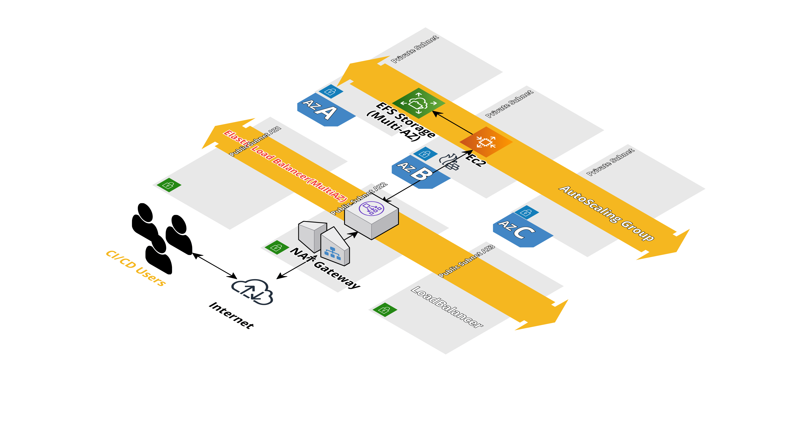

# Jenkins infrastructure Multi AZ - AWS hosted

## Architecture



## Contributing

This solution is enable to check quality of terraform code. The following checks will run on each commit.
### pre-commit

The following checks will run on each commit:

-   terraform format
-   terraform lint
-   tfsec scans
-   tf docs

## Terraform Backend Infra(AWS S3 State store)

Terraform state is stored in AWS S3 and locks are maintained in dynamodb. State file is encrypted with customer(user) owned KMS key to ensure data is super secure.

To create above described infrastructure, use template [file](terraform/infra/remote-state/tfstate_encrypted_cfn.yaml)

It is highly recommended to restrict/lockdown KMS key policy to limited users as in template. This can be done by adding AWS principal arns to Key usage of cloudformation template. Once the terraform state store infrastructure is provisioned, update values in below example backend [config](terraform/deployments/jenkins-stack/backend.hcl) to utilize S3 as an encrypted terraform state store

```hcl
terraform {
  backend "s3" {
    bucket         = "jenkins-terraform-state-production"
    encrypt        = "true"
    kms_key_id     = "arn:aws:kms:ap-south-1:278306660155:alias/jenkins-terraform-state-key-production"
    region         = "ap-south-1"
    dynamodb_table = "jenkins-terraform-state-production"
    key            = "jenkins/production.tfstate"
  }
}
```
## Create Jenkins Infrastructure

### Terraform init

- Change directory to `cd deployments/jenkins-stack` and run `terraform init -backend-config=backend.hcl` to initialize the working directory and download the required provider plugins and modules.

### Terraform plan

- Change directory to `cd deployments/jenkins-stack` , change parameters in [file](terraform/deployments/jenkins-stack/production.vars.json) as per your requirements and run `terraform plan -input=false -out=create.tfplan`. Review the infra changes in `create.tfplan`


### Terraform apply

- Change directory to `cd deployments/jenkins-stack` and run `terraform apply -input=false -out=create.tfplan` and review the infra changes in `create.tfplan`


## Things to consider

Below mentioned are the important steps to consider using this solution in production.

- Enable usage as Jenkins Configuration as code to defined the jenkins admin configuration.
- Enable SAML/OAUTH authentication and authorisation based on your organisation preference.
- Enable SSL certificated and consider using DNS.
- Consider blocking internet traffic into jenkins by allowing only known ips and perferable to host behind VPN.
- Consider enabling monitoring and alerting.


# Destroy stack

This automation creates various infrastructure components. It is recommended to delete, if you are not using them.
- Change directory to `cd deployments/jenkins-stack` andrun `terraform destroy`
